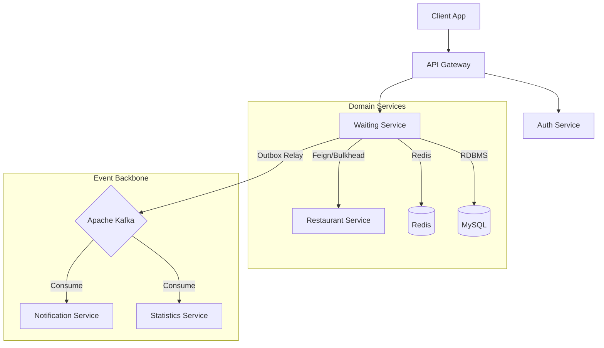

# Booster - 대규모 트래픽 대응 고가용성 웨이팅 시스템

> **"사용자가 몰려도 서버는 죽지 않아야 하고, 데이터는 단 1건도 유실되어서는 안 됩니다."**

**Booster**는 식당 대기(Waiting) 서비스를 MSA(Microservices Architecture)로 구현한 프로젝트입니다. 단순한 CRUD 구현을 넘어, 대규모 트래픽 상황에서 발생할 수 있는 **동시성 이슈, 분산 데이터 정합성 문제, 장애 전파(Cascading Failure)**를 해결하는 데 집중했습니다.

---

## 🏗️ System Architecture

### 전체 아키텍처
모든 마이크로서비스는 **Eureka**를 통해 동적으로 관리되며, **Spring Cloud Gateway**를 통해 라우팅됩니다. 데이터 변경 사항은 **Kafka**를 통해 비동기적으로 전파됩니다.

hello