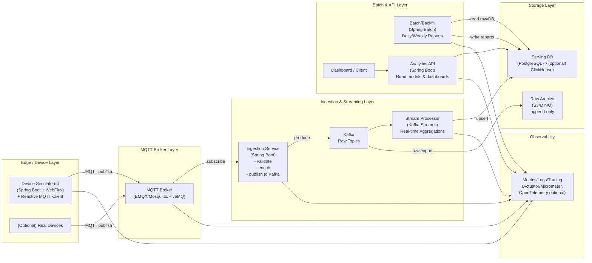
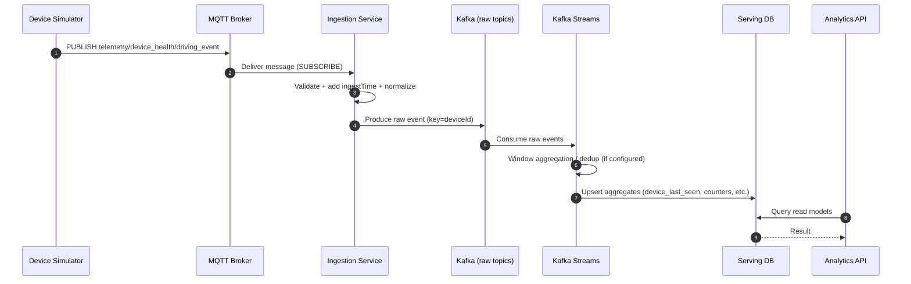
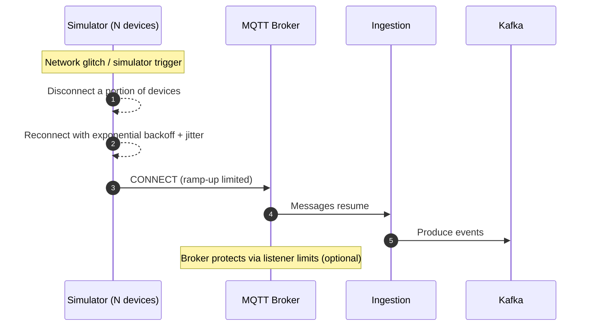

# TelemetryHub Planning Document (v0.1)

> 프로젝트 목적: **커넥티드 디바이스(차량/블랙박스/IoT)** 에서 발생하는 텔레메트리(주기 센서/상태/이벤트)를 **고성능으로 수집·적재**하고, **실시간/배치 분석 결과(통계·리포트·지표)** 를 제공하는 **데이터 파이프라인**을 Spring 생태계 기반으로 설계·구현한다.

> 진행 현황은 [status.md](/abs/path/C:/Users/NCand/Documents/bootser/apps/telemetryhub/status.md) 기준으로 관리한다.

---

## 진행 현황

### 완료
- `apps/telemetryhub` 멀티모듈 등록 완료
- 최상위 모듈 디렉토리 구성 완료
- `contracts` 모듈 기본 이벤트 계약 정의 완료
- `device-simulator` MVP 구현 완료
  - 제어 API
  - 이벤트 생성기
  - 시뮬레이터 loop
  - publisher 라우팅(`LOGGING` / `MEMORY` / `MQTT`)
  - 브로커 없는 `MEMORY` 모드 검증 API
  - 실제 MQTT 연결 확장 지점 확보

### 진행 예정
- `ingestion-service` 기본 구조 및 MQTT subscribe 경계 설계
- raw event validation / enrichment 설계
- Kafka raw topic publish 구조 설계
- observability 기본 메트릭 정의

### 보류
- 실제 MQTT broker 연동 smoke test
- docker 기반 broker 환경 구성
- stream processor / batch backfill 세부 구현
- analytics api / serving db 구현
- OLAP / schema registry / DLQ 같은 확장 로드맵 항목

### 참고 문서
- `device-simulator` 구조 설명: `apps/telemetryhub/docs/device-simulator-review.md`

---

## 1. 배경과 문제 정의

커넥티드 디바이스 환경의 데이터는 아래 특징을 가진다.

- **대량/고빈도**: 주기적으로 GPS·속도·센서 데이터가 발생한다.
- **네트워크 불안정**: 지연(late arrival), 중복(duplicate), 순서 뒤섞임(out-of-order)이 발생한다.
- **원본 보관 + 분석 결과 동시 요구**: 원본(raw)은 재처리(backfill)에 필요하고, 분석 결과는 서비스/API에 즉시 필요하다.
- **산식/정책 변경**: 안전 점수, 주행 요약, 상태 판단 로직은 변경되며 과거 데이터를 재계산해야 한다.

따라서 파이프라인은 “일단 받아서 저장”이 아니라 아래를 충족해야 한다.

- 유실/중복/순서 문제를 고려한 **신뢰성**
- throughput/latency를 고려한 **확장성**
- 재처리/백필 가능한 **재현성**
- 운영 지표와 장애 대응이 가능한 **관측 가능성(Observability)**

---

## 2. 목표

### 2.1 Must (핵심 목표)
1. MQTT 기반 텔레메트리를 안정적으로 수집하고 원본을 장기 보관한다.
2. 실시간 집계 지표(예: 디바이스 온라인율/이벤트량)를 생성하고 API로 제공한다.
3. 배치/재처리(backfill)로 동일 산식 기준의 결과를 재생성할 수 있다.
4. 파이프라인 상태를 수치로 관측(수집량, 지연, 실패율, Kafka lag 등)할 수 있다.

### 2.2 Won’t (이번 단계 비목표)
- ML 모델 학습/서빙(ADAS 모델 학습 자체)
- 완전한 보안/인증/권한 체계(초기에는 최소 토큰/서명 수준)

---

## 3. 사용자/이해관계자

- **운영자(Ops)**: 디바이스 온라인율, 수집 실패율, 지연 증가를 감시하고 장애에 대응
- **분석 사용자(Researcher)**: 조건 기반 집계/통계 추출, 리포트 생성
- **서비스 개발자(Product/Backend)**: 최신 상태 조회, 주행 요약/안전 점수 API 활용

---

## 4. 핵심 산출물(기능)

### 4.1 실시간(Streaming) 결과
- 디바이스별 **최신 수신 시각 / 온라인·오프라인 상태**
- 시간 윈도우(분/시간) 기준 **이벤트 수신량**
- 주행 이벤트(급정거/과속/충격) **카운트/분포**

### 4.2 배치(Batch) 결과
- 일/주 단위 주행 요약 리포트
- 산식 변경 시 **과거 N일 재처리(backfill)**

### 4.3 운영(Observability)
- Ingestion 처리량, 실패율, 지연
- Kafka consumer lag
- 스트림 집계 지연(p95)
- 배치 처리 시간/재시도 횟수

---

## 5. 데이터 정의

### 5.1 이벤트 타입(원본)
- **telemetry**
  - `eventId`, `deviceId`, `eventTime`, `ingestTime`
  - `lat`, `lon`, `speed`, `heading`, `accelX`, `accelY` ...
- **device_health**
  - `eventId`, `deviceId`, `eventTime`, `ingestTime`
  - `battery`, `temp`, `signalStrength`, `firmwareVersion`, `errorCode` ...
- **driving_event**
  - `eventId`, `deviceId`, `eventTime`, `ingestTime`
  - `type`(HARD_BRAKE/OVERSPEED/CRASH ...), `severity`, `context` ...

### 5.2 공통 설계 원칙
- **eventTime(디바이스 시간)** + **ingestTime(서버 수신 시간)** 둘 다 저장
- 중복 수신 대비: consumer는 **멱등 처리(idempotency)** 전제
- partitioning 키: 기본은 `deviceId` (한 디바이스 이벤트의 상대적 순서 안정화 목적)

---

## 6. 전체 아키텍처 조성도

> 아래 다이어그램은 “Control Plane(제어/관측)”과 “Data Plane(실데이터 흐름)”을 분리해 설계한다.  
> Device는 실제 장치 대신 **Device Simulator(가상 디바이스)** 로 대체 가능하다.



---

## 7. 데이터의 흐름도

### 7.1 정상 흐름(steady-state)


### 7.2 재접속 폭주(Thundering Herd) 시나리오


---

## 8. Device Simulator 설계 (가상 디바이스 생성기)

### 8.1 왜 필요한가?
실제 수만 대의 물리 디바이스를 구할 수 없으므로, 다음을 위해 **가상 디바이스 시뮬레이터**가 필요하다.

- 수천~수만 동시 연결을 생성해 **브로커/인제스트 병목**을 확인
- 장애 시나리오(재접속 폭주, 지연, 중복)를 의도적으로 만들어 **복원력(resilience)** 검증
- 파이프라인의 end-to-end 지연/실패율을 수치로 기록해 **포트폴리오 산출물**로 남김

### 8.2 WebFlux로 만들 때의 역할
- **Control Plane (WebFlux API)**: 시작/중지/스케일/시나리오 트리거
- **Data Plane (Reactive MQTT Client)**: 비동기 connect/publish

#### 제어 API 예시
- `POST /sim/start?devices=2000&intervalMs=1000&qos=0`
- `POST /sim/stop`
- `POST /sim/scale?devices=5000`
- `POST /sim/scenario/reconnect-storm?percent=30`
- `GET /actuator/metrics`

### 8.3 시뮬레이터 파라미터(운영 가능하게)
- `DEVICE_COUNT`: 인스턴스당 디바이스 수
- `DEVICE_ID_RANGE`: deviceId 샤딩 범위(레플리카끼리 중복 방지)
- `PUBLISH_INTERVAL_MS`
- `PAYLOAD_PROFILE`: payload 크기/필드 구성
- `QOS`: 0(주기 텔레메트리), 1(중요 이벤트) 등
- `CONNECT_RAMP_UP`: 초당 connect 생성 수
- `SCENARIO`: steady / reconnect-storm / late-event / duplicate-event

### 8.4 “수만 대”를 현실적으로 만드는 방법
단일 머신 한계(파일 디스크립터, 메모리, 네트워크)를 고려해:

- Simulator를 **여러 인스턴스로 수평 확장**
- 각 인스턴스는 `deviceId range`를 담당
- 총 디바이스 수 = `replica_count × DEVICE_COUNT`

---

## 9. 데이터 처리(Streaming) 설계 포인트

### 9.1 파티셔닝
- Kafka 토픽 키를 `deviceId`로 고정하여 **디바이스 단위 처리 분산** 및 상대적 순서 안정화
- 파티션 수는 목표 처리량에 따라 조정(추후 부하 테스트로 결정)

### 9.2 out-of-order / late event 대응
- eventTime 기반 윈도우 집계 사용
- 늦게 도착하는 이벤트는 grace period 내 반영
- grace period 밖은 배치/보정(backfill)으로 처리

### 9.3 중복 이벤트(멱등성)
- eventId 기반 dedup(전략은 구현 단계에서 결정)
- 집계 테이블은 upsert 중심 설계(최종 결과가 중복에 강하게)

---

## 10. 저장/서빙 전략(초기 선택)

### 10.1 Raw 저장
- Kafka retention은 “버퍼”로 사용하고,
- 장기 보관은 S3/MinIO 같은 object storage에 append-only로 적재(권장)

### 10.2 Serving DB
- **MVP**: PostgreSQL
  - 장점: 구현/운영 단순, 인덱스/파티셔닝으로 충분히 확장 가능
- **확장**: ClickHouse 같은 OLAP
  - 조건 검색/집계 고속화를 강조할 때 도입

---

## 11. MVP 범위(2~4주)

### 11.1 Ingestion
- MQTT subscribe → validation/enrichment → Kafka raw topic produce

### 11.2 Real-time aggregation (3종)
1) `device_last_seen` (최신 수신 시각, online 판정)
2) `events_per_minute` (수신량/토픽별 카운트)
3) `driving_event_counter` (급정거/과속/충격 카운트)

### 11.3 API
- 디바이스 최신 상태 조회
- 기간별 이벤트량 조회(대시보드용)

### 11.4 Observability
- 처리량/실패율/lag/지연을 메트릭으로 노출

---

## 12. 확장 로드맵

### v1
- 주행 세션(Trip) 분할(정지/이동 기반)
- 안전 점수 산식 v1 + 버전 관리
- 일/주 리포트 배치 + backfill

### v2
- 스키마 버전 관리(Avro/Protobuf + Schema Registry)
- DLQ/재처리 자동화, 운영 런북 강화
- OLAP 도입으로 조건 검색/대시보드 고도화

---

## 13. 성공 기준(측정 가능한 목표)

- **End-to-end 지연(p95)**: MQTT publish → 집계 결과 DB 반영까지의 지연
- **메시지 실패율**: publish 실패/ingestion 실패/stream 처리 실패
- **Kafka lag**: peak 상황에서의 lag 안정화
- **재접속 폭주 회복 시간**: reconnect-storm 시 정상 상태로 복귀까지 걸리는 시간
- **Backfill 처리 시간**: N일치 재처리 소요 시간

---

## 14. 리스크 및 대응

- 단일 머신에서의 동시 커넥션 한계  
  → 시뮬레이터 수평 확장(레플리카), OS 튜닝(실험 기록)
- out-of-order/duplicate로 인한 집계 왜곡  
  → eventTime/ingestTime 저장, dedup 전략, grace period, backfill 설계
- 스키마 변경으로 인한 소비자 오류  
  → 스키마 버전/호환성 규칙 도입(v2 로드맵)

---

## 15. 다음에 확정할 질문(설계로 내려가기 전)
1) 텔레메트리 전송 주기: 1s / 5s / 10s 중 MVP 기본값?
2) QoS 전략: 주기 데이터(QoS0) + 이벤트(QoS1)로 분리할지?
3) Serving DB: MVP Postgres로 시작 후 OLAP 확장할지?

---

### 부록 A. ASCII 다이어그램(mermaid 미지원 환경용)

**Architecture (ASCII)**
```
[Device Simulator(s)] -> [MQTT Broker] -> [Ingestion] -> [Kafka Raw Topics] -> [Kafka Streams] -> [Serving DB]
                                          |                                   |
                                          +-> [Raw Archive (S3/MinIO)]         +-> [Aggregations]
[Batch/Backfill] -------------------------------------------------------------> [Serving DB]
[Analytics API] <-------------------------------------------------------------- [Serving DB]
```

**Data Flow (ASCII)**
```
Simulator publish -> Broker -> Ingestion validate/enrich -> Kafka -> Stream aggregate -> DB upsert -> API read
```
