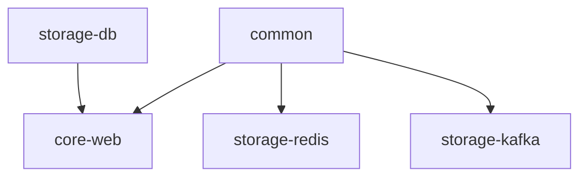

# 📦 Libs Module Specification

이 문서는 `libs` 디렉토리 하위의 공통 모듈들에 대한 통합 명세서입니다. 각 모듈은 마이크로서비스 간의 코드 중복을 줄이고 일관성을 유지하기 위해 설계되었습니다.

---

## 1. Common Module (`libs/common`)
프로젝트 전반에서 사용되는 순수 자바 기반 유틸리티 및 공통 도메인 모델을 제공합니다.

### 1.1. 주요 기능
- **DateUtils**: 프로젝트 표준 시간 계산 로직 제공.
- **JsonUtils**: Jackson `ObjectMapper`를 래핑하여 일관된 직렬화/역직렬화 지원.
- **SnowflakeGenerator**: 트위터 Snowflake 알고리즘 기반의 분산 ID 생성기 (Singleton 패턴, Spring 의존성 없음).

### 1.2. 설계 원칙
- **도메인 독립적**: 특정 프레임워크에 의존하지 않는 POJO 위주 구성.
- **확장성**: 향후 `StringValidator`, `RandomUtils`, 암호화 유틸리티 등 추가 예정.

---

## 2. Core-Web Module (`libs/core-web`)
웹 애플리케이션 계층의 공통 응답 규격 및 전역 예외 처리를 담당합니다.

### 2.1. 주요 기능
- **ApiResponse**: 성공/실패 응답을 위한 표준 포맷 (Record 활용).
- **ResultType**: HTTP 상태 코드를 보완하는 세밀한 결과 상태 Enum.
- **GlobalExceptionHandler**: `@RestControllerAdvice`를 통한 전역 예외 처리 및 표준 응답 변환.
- **CoreWebConfig**: Jackson 설정 및 웹 관련 공통 Bean 설정.

### 2.2. 예외 처리 구조
- **ErrorCode (Interface)**: 도메인별 에러 코드 추상화.
- **CommonErrorCode (Enum)**: 시스템 공통 에러 정의 (400, 500 등).
- **CoreException**: 비즈니스 로직용 최상위 사용자 정의 예외.

---

## 3. Storage-DB Module (`libs/storage-db`)
RDB(PostgreSQL) 접근을 위한 JPA 및 QueryDSL 설정을 관리합니다.

### 3.1. 주요 기능
- **JpaConfig**: JPA Auditing 및 EntityManager 설정.
- **QueryDslConfig**: `JPAQueryFactory` Bean 등록 (타입 안전한 쿼리 작성 지원).
- **BaseEntity**: `createdAt`, `updatedAt` 등 공통 필드를 관리하는 `@MappedSuperclass`.

### 3.2. 특징
- **Test Fixtures**: 테스트 설정을 공유하기 위해 `java-test-fixtures` 플러그인 사용.
- **QueryDSL**: Jakarta EE 호환 버전 사용.

---

## 4. Storage-Redis Module (`libs/storage-redis`)
Redis 연동 및 분산 락 기능을 제공합니다.

### 4.1. 주요 기능
- **Redis 설정**: `GenericJacksonJsonRedisSerializer` 사용 (Java 8 날짜 타입 호환).
- **분산 락 (Distributed Lock)**:
  - **Redisson** 기반 구현.
  - **@DistributedLock**: AOP를 활용한 선언적 락 적용 (SpEL 지원).
- **테스트 환경**: `Embedded Redis`를 활용한 격리된 테스트 환경 제공.

### 4.2. 기술 스택
- **Redisson**: 분산 락 구현체.
- **Spring Data Redis**: 기본 Redis 클라이언트.

---

## 5. Storage-Kafka Module (`libs/storage-kafka`)
Kafka 메시징을 위한 공통 설정 및 래퍼를 제공합니다.

### 5.1. 주요 기능
- **KafkaConfig**: Producer/Consumer Factory 수동 설정 (데이터 정합성 보장).
- **KafkaProducer**: `KafkaTemplate`을 감싼 래퍼 클래스.
- **KafkaTopic**: 토픽 이름을 관리하는 Enum (타입 안정성 확보).

### 5.2. 설계 원칙
- **직렬화 통일**: `common` 모듈의 `JsonUtils`를 사용하여 Redis/DB/Kafka 간 데이터 포맷 일치.
- **명시적 제어**: 자동 설정(`KafkaAutoConfiguration`)에 의존하지 않고 빈을 수동으로 구성.

---

## 6. 모듈 간 의존성 관계

* `common` 모듈은 가장 하위 레벨에서 다른 모든 모듈의 기반이 됩니다.
* `core-web`은 웹 계층의 공통 기능을 제공하며, `storage-db`와 함께 사용될 수 있습니다.
